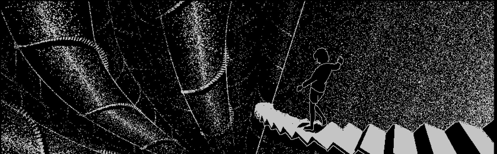

[](https://git.io/typing-svg)

<p>
 

```
aylaboo@github
-------------------------
🏫 UFFS - Chapecó
📜 Entusiasta em programação competitiva e buscando aprender cybersec futuramente
💫 Linguagens: Python, C++, JavaScript
🔮 linux ricing / rpg / música / fotografia
🎵 shoegaze / breakcore / experimental
```
</p>

<br><br><br><br>
## **Status**

